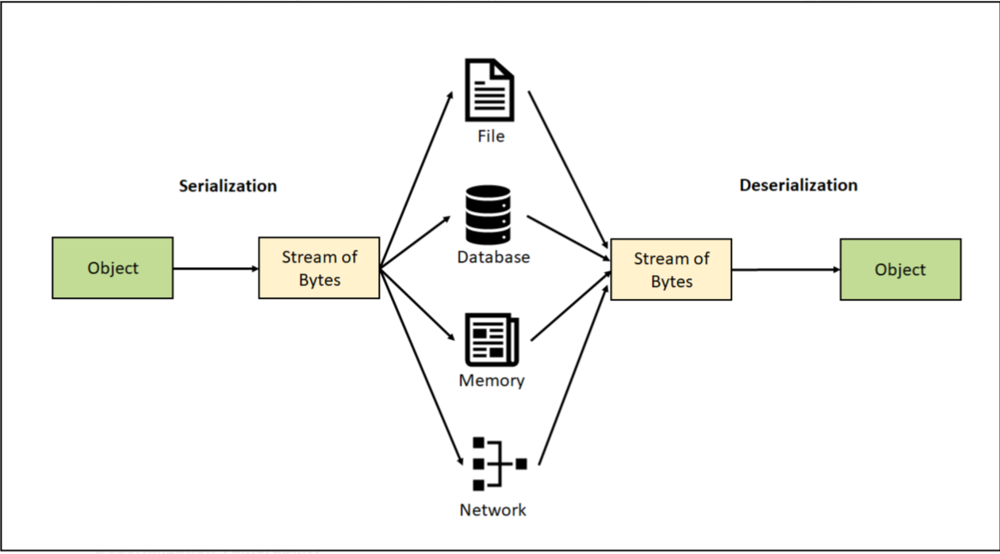

# Java Serialization

> Java provides a mechanism, called object serialization where an object can be represented as a sequence of bytes that includes the object's data as well as information about the object's type and the types of data stored in the object.

Serialization is the conversion of the state of an object into a byte stream; deserialization does the opposite. Stated
differently, serialization is the conversion of a Java object into a static stream (sequence) of bytes, which we can
then save to a database or file or transfer over a network.

The reverse operation of serialization is called deserialization where byte-stream is converted into a "copy" of the
object.

The serialization and deserialization process is platform-independent, it means you can serialize an object on one
platform and deserialize it on a different platform.

For serializing the object, we call the `writeObject()` method of `ObjectOutputStream` class, and for deserialization we
call the `readObject()` method of `ObjectInputStream` class.

We must have to implement the `Serializable` interface for serializing the object.

Serialization is mainly used in Hibernate, RMI, JPA and JMS technologies.

## Table of contents

1. Introduction
2. Serialization with memory buffer
3. Serialization with file
4. Serialization versioning
5. Serialization with array field members
6. Serialization with Java Objects as array
7. Serialization with collection field members
8. Serialization with Java Objects as Collection
9. Serialization with Enum Constants
10. Serialization with static fields
11. Object graphs
12. Using transient keyword
13. Using writeObject() and readObject()
14. Using ObjectStreamField
15. Protecting sensitive information
16. How Inheritance Affects Serialization
17. Using Externalizable
18. Using ObjectInputValidation
19. Using writeReplace() and readResolve()
20. Singleton pattern and readResolve()
21. Using ObjectInputFilter
22. Serialization Proxy Pattern
23. Exercises and Solutions

### GitHub

[Java Serialization](https://github.com/backstreetbrogrammer/05_Persistence)

### References

[Java Specifications](https://docs.oracle.com/en/java/javase/11/docs/specs/serialization/index.html)

### Youtube

[Java Serialization Playlist](https://youtube.com/playlist?list=PLQDzPczdXrTjGLkI8kd2d0bfNHx0v7dTy)

- [01 - Java Serialization Tutorial Series](https://youtu.be/F5POMzyLf7c)
- [02 - Java Serialization - Table Of Contents](https://youtu.be/W2ZWKwYsNvM)
- [03 - Java Serialization - Java, Maven and IntelliJ installations](https://youtu.be/baSkl5eIrNo)
- [04 - Java Serialization - Maven Project Setup on IntelliJ](https://youtu.be/eXezwNStAfU)

---

### Chapter 01 - Introduction

Suppose I want to save the state of one or more objects.

If Java didn’t have serialization, I would have to use one of the IO classes to write out the state of the instance
variables of all the objects I wanted to save - say to a csv, xml, json or just plain text.

Then I would need to reconstruct the objects that had been saved in the same order of instance fields as it was saved.
This is error-prone as we are doing lots of stuff manually here.

Also, if the objects are huge - containing reference to other objects (Object Graphs) and many instance fields, then the
manual processing of serialization and deserialization would be very complex and error-prone.

Java’s object serialization allows us to take any object that implements the `Serializable` interface and turn it into a
sequence of bytes that can later be fully restored to regenerate the original object.

This is even true across a network, which means that the serialization mechanism automatically compensates for
differences in operating systems.

That is, I can create an object on a Windows machine, serialize it, and send it across the network to a Unix machine,
where it will be correctly reconstructed.

I don’t have to worry about the data representations on the different machines, the byte ordering, or any other details.



Java POJO class object containing only primitive fields (`int`, `char`, `float`, `double`, `long`) and `String` fields
can be serialized by just implementing `Serializable` interface and using these 2 methods:

- `ObjectOutputStream.writeObject()` => serialize and write
- `ObjectInputStream.readObject()` => read and deserialize

#### Youtube

- [05 - Java Serialization - Introduction - Theory](https://youtu.be/Zas-PqxXNE8)
- [06 - Java Serialization - Introduction - Code Demo 1](https://youtu.be/KGriEzFUGWA)
- [07 - Java Serialization - Introduction - Code Demo 2](https://youtu.be/UylAJ6EOyFg)

#### GitHub

- [Chapter 01 - Introduction](https://github.com/backstreetbrogrammer/05_Persistence/tree/main/src/main/java/com/backstreetbrogrammer/chapter01_introduction)
- [Chapter 01 - Introduction - Unit Tests](https://github.com/backstreetbrogrammer/05_Persistence/tree/main/src/test/java/com/backstreetbrogrammer/chapter01_introduction)

---

### Chapter 02 - Serialization with memory buffer

The first example is using memory as buffer to where the serialized streams of bytes will be written to and then
retrieved from using deserialization.

- Java Object => Serialize to byte array => Memory
- Memory => Deserialize from byte array => Java Object

`ByteArrayOutputStream` class is used to serialize to byte array. This class implements an output stream in which the
data is written into a byte array. The buffer automatically grows as data is written to it. The data can be retrieved
using `toByteArray()` and `toString()`.

`ByteArrayInputStream` class is used to deserialize from byte array. This class contains an internal buffer that
contains bytes that may be read from the stream. An internal counter keeps track of the next byte to be supplied by the
read method.

**Drawback** using memory buffer is that once the JVM shuts down - the serialized data in memory is erased and can not
be used after application restart.

#### Youtube

- [08 - Java Serialization with memory buffer - Theory](https://youtu.be/UgUuutfs828)
- [09 - Java Serialization with memory buffer - Code Demo 1](https://youtu.be/s0LnxU1zL5A)
- [10 - Java Serialization with memory buffer - Code Demo 2](https://youtu.be/CN4vcPtP9Vw)
- [11 - Java Serialization with memory buffer - Code Demo 3](https://youtu.be/cdRxfbdJ_ow)

#### GitHub

- [Chapter 02 - Serialization with memory buffer](https://github.com/backstreetbrogrammer/05_Persistence/tree/main/src/main/java/com/backstreetbrogrammer/chapter02_serializationwithmemorybuffer)
- [Chapter 02 - Serialization with memory buffer - Unit Tests](https://github.com/backstreetbrogrammer/05_Persistence/tree/main/src/test/java/com/backstreetbrogrammer/chapter02_serializationwithmemorybuffer)

---

### Chapter 03 - Serialization with file

It would be incredibly useful if an object could exist and hold its information even while the program wasn’t running.

Then, the next time we started the program, the object would be there, and it would have the same information or state
it had the previous time the program was running.

Object serialization allows us to implement persistence. **Persistence** means that an object’s lifetime is not
determined by whether a program is executing; the object lives in between invocations of the program. By taking a
serializable object and writing it to disk (via file), then restoring that object when the program is re-invoked, we’re
able to produce the effect of persistence.

- Java Object => Stream of bytes => File
- File => Deserialize from stream of bytes => Java Object

`FileOutputStream` class is used to write the serialized stream of bytes to file on the disk. This class is an output
stream for writing data to a File and is meant for writing streams of raw bytes such as image data.

`FileInputStream` class is used to read the stream of bytes from the file. This class obtains input bytes from a file in
a file system and is meant for reading streams of raw bytes such as image data.

#### Youtube

- [12 - Java Serialization with file - Theory](https://youtu.be/v3nMZmeRT4c)
- [13 - Java Serialization with file - Code Demo](https://youtu.be/O9HMVSqezGU)

#### GitHub

- [Chapter 03 - Serialization with file](https://github.com/backstreetbrogrammer/05_Persistence/tree/main/src/main/java/com/backstreetbrogrammer/chapter03_serializationwithfile)
- [Chapter 03 - Serialization with file - Unit Tests](https://github.com/backstreetbrogrammer/05_Persistence/tree/main/src/test/java/com/backstreetbrogrammer/chapter03_serializationwithfile)

---

### Chapter 04 - Serialization versioning

Suppose we have a class, and we have serialized its object to a file on the disk, and due to some new requirements, we
added/removed one field from our class. Or just added a new utility method to it. Now, if we try to deserialize the
already serialized object, we will get `InvalidClassException`.

When we serialize a class, each class has a unique identification number associated with it. Its also called stream
unique identifiers, more commonly known as serial versionUIDs.

If we do not specify this number by declaring a static final long field named `serialVersionUID`, the system
automatically generates it at runtime by applying a cryptographic hash function (SHA-1) to the structure of the class.

This value is affected by the names of the class, the interfaces it implements, and most of its members, including
synthetic members generated by the compiler.

If we change any of these things, for example, by adding a convenience method, the generated serial version UID changes.
If we fail to declare a serial version UID, compatibility will be broken, resulting in an `InvalidClassException` at
runtime.

The basic idea is a class could have been serialized with an older version of the class and deserialized with a newer
version of the class.

The `serialVersionUID` helps inform the JVM that the stored data may not match the new class definition.

Thus, if an older version of the class is encountered during deserialization, a `java.io.InvalidClassException` is
thrown.

*Conclusion*: It's a good practice to declare a static `serialVersionUID` variable in every class that implements
`Serializable`.

#### Youtube

- [14 - Java Serialization Versioning - Theory](https://youtu.be/ADSp_A4oCeo)
- [15 - Java Serialization Versioning - Code Demo 1](https://youtu.be/YCDbwAl0PV0)
- [16 - Java Serialization Versioning - Code Demo 2](https://youtu.be/eT-OrSB2Tos)

#### GitHub

- [Chapter 04 - Serialization versioning](https://github.com/backstreetbrogrammer/05_Persistence/tree/main/src/main/java/com/backstreetbrogrammer/chapter04_serializationversioning)
- [Chapter 04 - Serialization versioning - Unit Tests](https://github.com/backstreetbrogrammer/05_Persistence/tree/main/src/test/java/com/backstreetbrogrammer/chapter04_serializationversioning)

---

### Chapter 05 - Serialization with array field members

Suppose we have a class which has array of primitives or array of Objects as its field members.

In this scenario, we need to ensure that every element in the array is `Serializable`, otherwise the serialization will
fail.

#### Youtube

- [17 - Java Serialization with array field members - Code Demo](https://youtu.be/nyAyOiB3QrU)

#### GitHub

- [Chapter 05 - Serialization with array field members](https://github.com/backstreetbrogrammer/05_Persistence/tree/main/src/main/java/com/backstreetbrogrammer/chapter05_serializationwitharrayfields)
- [Chapter 05 - Serialization with array field members - Unit Tests](https://github.com/backstreetbrogrammer/05_Persistence/tree/main/src/test/java/com/backstreetbrogrammer/chapter05_serializationwitharrayfields)

---

### Chapter 06 - Serialization with Java Objects as array

If we have an array of a serializable class objects, the whole array can be serialized in one go by just calling
`writeObject()` method from `ObjectOutputStream` class.

We need to ensure that every element in the array is `Serializable`, otherwise the serialization will fail.

Similarly, while deserialization, the whole array object can be read by calling `readObject()` method from
`ObjectInputStream` class.

#### Youtube

- [18 - Java Serialization with Java Objects as array - Code Demo 1](https://youtu.be/z5DBex6obTk)
- [19 - Java Serialization with Java Objects as array - Code Demo 2](https://youtu.be/Nm78tlCM7oE)

#### GitHub

- [Chapter 06 - Serialization with Java Objects as array](https://github.com/backstreetbrogrammer/05_Persistence/tree/main/src/main/java/com/backstreetbrogrammer/chapter06_serializationwitharrayobjects)
- [Chapter 06 - Serialization with Java Objects as array - Unit Tests](https://github.com/backstreetbrogrammer/05_Persistence/tree/main/src/test/java/com/backstreetbrogrammer/chapter06_serializationwitharrayobjects)

---

### Chapter 07 - Serialization with collection field members

Suppose we have a class which has collection of objects say List as its field members.

In this scenario, we need to ensure that every element in the collection is `Serializable`, otherwise the serialization
will fail.

Please note that while the collection interfaces like List, Set, etc. are NOT serializable, the concrete collection
classes like `ArrayList`, `HashSet` etc. ARE serializable.

#### Youtube

- [20 - Java Serialization with collection field members - Code Demo](https://youtu.be/q_EB2CrE8mg)

#### GitHub

- [Chapter 07 - Serialization with collection field members](https://github.com/backstreetbrogrammer/05_Persistence/tree/main/src/main/java/com/backstreetbrogrammer/chapter07_serializationwithlistfields)
- [Chapter 07 - Serialization with collection field members - Unit Tests](https://github.com/backstreetbrogrammer/05_Persistence/tree/main/src/test/java/com/backstreetbrogrammer/chapter07_serializationwithlistfields)

---

### Chapter 08 - Serialization with Java Objects as Collection

If we have a collection (`List`, `Set`, etc) of a serializable class objects, the whole collection can be serialized in
one go by just calling `writeObject()` method from `ObjectOutputStream` class.

We need to ensure that every element in the collection is `Serializable`, otherwise the serialization will fail.

Similarly, while deserialization, the whole collection object can be read by calling `readObject()` method from
`ObjectInputStream` class.

#### Youtube

- [21 - Java Serialization with Java Objects as Collection - Code Demo](https://youtu.be/hJ_Gf9w5Agg)

#### GitHub

- [Chapter 08 - Serialization with Java Objects as Collection](https://github.com/backstreetbrogrammer/05_Persistence/tree/main/src/main/java/com/backstreetbrogrammer/chapter08_serializationwithlistobjects)
- [Chapter 08 - Serialization with Java Objects as Collection - Unit Tests](https://github.com/backstreetbrogrammer/05_Persistence/tree/main/src/test/java/com/backstreetbrogrammer/chapter08_serializationwithlistobjects)

---

### Chapter 09 - Serialization with Enum Constants

As per Java specifications, `Enum` constants are serialized differently than ordinary serializable objects.

The serialized form of an enum constant consists solely of its name; field values of the constant are not present in the
form.

To **serialize** an enum constant, `ObjectOutputStream` writes the value returned by the enum constant’s `name()`
method.

For reference,

- `name()` is an instance method which returns the name of the instance.
- `valueOf()` is a static method taking a `String` and returning the enum instance with that name.
- `values()` is a static method returning all the enum instances.

To **deserialize** an enum constant, `ObjectInputStream` reads the constant name from the stream; the deserialized
constant is then obtained by calling the `valueOf()` method, passing the constant’s enum type along with the received
constant name as arguments.

Few more points to take note of:

- enum types have a fixed `serialVersionUID` of `0L` and cannot be changed
- process by which enum constants are serialized cannot be customized: any class-specific `writeObject()`
  , `readObject()`,
  `readObjectNoData()`, `writeReplace()` and `readResolve()` methods defined by enum types are ignored during
  serialization and deserialization

#### Youtube

- [22 - Java Serialization with Enum Constants - Code Demo 1](https://youtu.be/EChfTzyhp6c)
- [23 - Java Serialization with Enum Constants - Code Demo 2](https://youtu.be/cs94RBaU654)

#### GitHub

- [Chapter 09 - Serialization with Enum Constants](https://github.com/backstreetbrogrammer/05_Persistence/tree/main/src/main/java/com/backstreetbrogrammer/chapter09_serializationwithenum)
- [Chapter 09 - Serialization with Enum Constants - Unit Tests](https://github.com/backstreetbrogrammer/05_Persistence/tree/main/src/test/java/com/backstreetbrogrammer/chapter09_serializationwithenum)

---

### Chapter 10 - Serialization with static fields

Static fields are NEVER saved as part of the object’s state.

We should think of static variables purely as CLASS variables. They have nothing to do with individual instances. And
serialization applies only to OBJECTS.

Suppose we have 3 instances of a `Serializable` class => all of which were serialized at different times, and thus all
of which were saved when the value of a static variable in the class was different.

Now, if static variables were serializable, which of the 3 instances would win ? OR, Which instance’s static value would
be used to replace the one currently in the one and only class that’s currently loaded ?

=> This is a problem… that’s why, static fields are never part of serialization / deserialization process.

#### Youtube

- [24 - Java Serialization with static fields - Code Demo](https://youtu.be/gqLPbcK91ko)

#### GitHub

- [Chapter 10 - Serialization with static fields](https://github.com/backstreetbrogrammer/05_Persistence/tree/main/src/main/java/com/backstreetbrogrammer/chapter10_serializationwithstaticfields)
- [Chapter 10 - Serialization with static fields - Unit Tests](https://github.com/backstreetbrogrammer/05_Persistence/tree/main/src/test/java/com/backstreetbrogrammer/chapter10_serializationwithstaticfields)

---

### Chapter 11 - Object graphs

Java's default serialization process is fully recursive, so whenever we try to serialize one object, the serialization
process try to serialize all the fields (primitive and reference) with our class (except `static` and `transient`
fields).

The reference to objects fields are serialized and Java serialization takes care of saving that object’s entire “object
graph”. That means a deep copy of everything the saved objects needs to be stored.

Just remember to implement the `Serializable` interface for all the objects in the “object graph” - otherwise we will
get
`NotSerializableException`.

#### Youtube

- [25 - Java Serialization with Object graphs - Code Demo](https://youtu.be/qbu7mOHwIQM)

#### GitHub

- [Chapter 11 - Object graphs](https://github.com/backstreetbrogrammer/05_Persistence/tree/main/src/main/java/com/backstreetbrogrammer/chapter11_objectgraphs)
- [Chapter 11 - Object graphs - Unit Tests](https://github.com/backstreetbrogrammer/05_Persistence/tree/main/src/test/java/com/backstreetbrogrammer/chapter11_objectgraphs)

---

### Chapter 12 - Using transient keyword

Suppose one of the objects in the “object graph” is not accessible (meaning we can’t modify it due to permission issues)
and not marked as `Serializable`. In that case, are we blocked to serialize our main class which has reference to that
read-only object?

One option is to subclass that read-only class, but it may be marked as `final`. OR, we don’t know if the read-only
class object has other similar objects in its own “object graph”.

There are other private members fields (primitive and reference) of a class which contains sensitive data like
passwords, or it doesn’t make sense to serialize it - like the state of an in-memory `Thread`.

That’s where the `transient` modifier comes in. By marking the members fields (primitive and reference) as `transient`,
these fields are NOT serialized just like `static` fields.

What happens to data marked `transient` on deserialization? It reverts to its default Java values, such as `0.0D` for
`double`, `false` for `boolean` or `null` for an object.

#### Youtube

- [26 - Java Serialization using transient keyword - Theory](https://youtu.be/6BAgEmzTIgU)
- [27 - Java Serialization using transient keyword - Code Demo](https://youtu.be/syWzyLCWPzk)

#### GitHub

- [Chapter 12 - Using transient keyword](https://github.com/backstreetbrogrammer/05_Persistence/tree/main/src/main/java/com/backstreetbrogrammer/chapter12_transient)
- [Chapter 12 - Using transient keyword - Unit Tests](https://github.com/backstreetbrogrammer/05_Persistence/tree/main/src/test/java/com/backstreetbrogrammer/chapter12_transient)

---

### Chapter 13 - Using writeObject() and readObject()

Just based on the above example, if one of the reference object is not accessible, and we had to mark it as `transient`.
While deserialization, the `transient` reference object will come as default value of `null`. What can we do to somehow
make sure that it matches the same object state when it was saved ?

Java serialization has a special mechanism just for this - a set of private methods we can implement such that it will
be invoked automatically during serialization and deserialization.

These 2 special methods we define must have signatures that look EXACTLY like this:

1) For serialization

````
private void writeObject(ObjectOutputStream stream) { 
   // code for saving the object 
}
````

2) For deserialization:

````
private void readObject(ObjectInputStream stream) { 
   // code for restoring the same object as it was saved although if its transient 
}
````

By implementing these 2 methods, we can customize or control the default Java serialization process.

Also, we can call the methods like `ObjectOutputStream.defaultWriteObject()` and `ObjectInputStream.defaultReadObject()`
to invoke the default Java serialization and deserialization process inside `writeObject()` and `readObject()` methods
respectively.

#### Youtube

- [28 - Java Serialization using writeObject() and readObject() - Theory](https://youtu.be/WWoL6EDotyw)
- [29 - Java Serialization using writeObject() and readObject() - Code Demo 1](https://youtu.be/lBPkDTUH1Z0)
- [30 - Java Serialization using writeObject() and readObject() - Code Demo 2](https://youtu.be/a0lR17k7DC8)

#### GitHub

- [Chapter 13 - Using writeObject() and readObject()](https://github.com/backstreetbrogrammer/05_Persistence/tree/main/src/main/java/com/backstreetbrogrammer/chapter13_writeObjectReadObject)
- [Chapter 13 - Using writeObject() and readObject() - Unit Tests](https://github.com/backstreetbrogrammer/05_Persistence/tree/main/src/test/java/com/backstreetbrogrammer/chapter13_writeObjectReadObject)

---

### Chapter 14 - Using ObjectStreamField

In case of `transient` keyword, we chose which member fields (primitive and reference) of a class SHOULD NOT participate
in serialization and deserialization process. This is also called as **blacklisting**.

Using `ObjectStreamField` class and `ObjectOutputStream.putFields` and `ObjectInputStream.readFields`, we can choose
which member fields (primitive and reference) of a class SHOULD participate in serialization and deserialization
process. This is also called as **whitelisting**.

Ideally **whitelisting** should be preferred over **blacklisting** as we have full control on which fields to serialize
or not.

#### Youtube

- [31 - Java Serialization using ObjectStreamField - Theory](https://youtu.be/yc4uTPSReFc)
- [32 - Java Serialization using ObjectStreamField - Code Demo 1](https://youtu.be/deuhH8nqwaY)
- [33 - Java Serialization using ObjectStreamField - Code Demo 2](https://youtu.be/P6fPT1v43IQ)

#### GitHub

- [Chapter 14 - Using ObjectStreamField](https://github.com/backstreetbrogrammer/05_Persistence/tree/main/src/main/java/com/backstreetbrogrammer/chapter14_usingobjectstreamfield)
- [Chapter 14 - Using ObjectStreamField - Unit Tests](https://github.com/backstreetbrogrammer/05_Persistence/tree/main/src/test/java/com/backstreetbrogrammer/chapter14_usingobjectstreamfield)

---

### Chapter 15 - Protecting sensitive information

When developing a class that provides controlled access to resources, care must be taken to protect sensitive
information and functions. During deserialization, the private state of the object is restored. To avoid compromising a
class, the sensitive state of an object must not be restored from the stream, or it must be re-verified by the class.

The easiest technique is to mark fields that contain sensitive data as `private transient`. Transient fields are not
persistent and will not be saved by any persistence mechanism. Marking the field will prevent the state from appearing
in the stream and from being restored during deserialization. Since writing and reading (of private fields) cannot be
superseded outside the class, the `transient` fields of the class are safe.

However, if we really want to serialize secured or confidential fields, we should use **encryption** and **decryption**
of the field. We will use Message Digest **SHA-1** **AES** algorithm for "encryption" and "decryption" of the secured
fields.

**ERRATA**: I have changed the hash function from "SHA-1" to "SHA-512" as "SHA-1" is not secured and not used anymore.

#### Youtube

- [34 - Java Serialization - Protecting sensitive information - Code Demo 1](https://youtu.be/tPWyMgbjuTw)
- [35 - Java Serialization - Protecting sensitive information using SHA1 - Code Demo 2](https://youtu.be/y_2To9_ads0)
- [36 - Java Serialization - Protecting sensitive information using SHA1 - Code Demo 3](https://youtu.be/05Lx0In1YvQ)
- [37 - Java Serialization - Protecting sensitive information using SHA1 - Unit Tests Code Demo](https://youtu.be/YT9L_M3xvCY)

#### GitHub

- [Chapter 15 - Protecting sensitive information](https://github.com/backstreetbrogrammer/05_Persistence/tree/main/src/main/java/com/backstreetbrogrammer/chapter15_securedFields)
- [Chapter 15 - Protecting sensitive information - Unit Tests](https://github.com/backstreetbrogrammer/05_Persistence/tree/main/src/test/java/com/backstreetbrogrammer/chapter15_securedFields)

---

### Chapter 16 - How Inheritance Affects Serialization

If a **superclass** is `Serializable`, then all **subclasses** are automatically `Serializable` without having to
explicitly mark the subclass as `Serializable`.

If a class does NOT explicitly extend any other class and does NOT implement `Serializable`, then we can confirm that
the class is NOT serializable as class `Object` does NOT implement `Serializable`.

Now suppose a subclass implements `Serializable` but the super class does NOT. How is this going to affect
serialization?

When an object is constructed using new (as opposed to being deserialized), following things happen in this sequence:

1. All instance variables are assigned **default** values - like `int` as `0`, `double` as `0D`, `boolean` as `false`
   , `String` as `null`, etc.

2. The **constructor** is invoked, which immediately invokes the superclass constructor OR another overloaded
   constructor, until one of the overloaded constructors invokes the superclass constructor.

3. All **superclass constructors** complete.

4. Instance variables that are initialized as part of their declaration are assigned their initial value overriding the
   default values they’re given prior to the superclass constructors completing.

5. The constructor completes.

BUT, these things do NOT happen when an object is **deserialized**.

If the constructor were invoked, and/or variables were assigned the values given in their declarations, the object we
are trying to restore would revert to its original state, rather than coming back reflecting the changes in its state
that happened sometime after it was created.

In other words, we want only the values saved as part of the serialized state of the object to be reassigned.

If the superclass is not `Serializable`, the instance variables in the subclass (which implements `Serializable`) will
be serialized and deserialized correctly, but the **inherited variables** from the non-serializable superclass will come
back with their default/initially assigned values rather than the values they had at the time of serialization.

Thus, if a subclass implements `Serializable` but the super class does NOT, then any instance variables INHERITED from
that superclass will be reset to the values they were given during the original construction of the object. This is
because the non-serializable class constructor WILL run.

In fact, every constructor ABOVE the first non-serializable class constructor will also run in the inheritance tree.

#### Youtube

- [38 - How Inheritance Affects Java Serialization - Theory](https://youtu.be/jf6CuLqmSvQ)
- [39 - How Inheritance Affects Java Serialization - Code Demo 1](https://youtu.be/3Tr6MDfMykg)
- [40 - How Inheritance Affects Java Serialization - Unit Tests Code Demo](https://youtu.be/cEuYppBx2Rk)

#### GitHub

- [Chapter 16 - How Inheritance Affects Serialization](https://github.com/backstreetbrogrammer/05_Persistence/tree/main/src/main/java/com/backstreetbrogrammer/chapter16_inheritance)
- [Chapter 16 - How Inheritance Affects Serialization - Unit Tests](https://github.com/backstreetbrogrammer/05_Persistence/tree/main/src/test/java/com/backstreetbrogrammer/chapter16_inheritance)

---

### Chapter 17 - Using Externalizable

If we want to fully control serialization and override JVM default serialization process, we can implement the
`Externalizable` interface and override its methods `writeExternal()` and `readExternal()`.

Using `Externalizable`, complete serialization/deserialization logic becomes developer's responsibility.

We need to tell what to serialize using `writeExternal()` method and what to deserialize using `readExternal()`. With
implementation of `writeExternal()` and `readExternal()`, methods `writeObject()` and `readObject()` becomes redundant
and do not get called.

We can even serialize/deserialize `static` and `transient` variables, although it will be a bad practice to do so.

When an `Externalizable` object is reconstructed, the object is created using public no-arg constructor before the
`readExternal()` method is called.

If a public no-arg constructor is not present then a `InvalidClassException` is thrown at runtime.

#### Youtube

- [41 - Java Serialization using Externalizable - Theory](https://youtu.be/H4iprygvnaU)
- [42 - Java Serialization using Externalizable - Code Demo 1](https://youtu.be/xEKqIbIU6PE)
- [43 - Java Serialization using Externalizable - Unit Test Code Demo](https://youtu.be/nZZjh8tUoHk)

#### GitHub

- [Chapter 17 - Using Externalizable](https://github.com/backstreetbrogrammer/05_Persistence/tree/main/src/main/java/com/backstreetbrogrammer/chapter17_externalizable)
- [Chapter 17 - Using Externalizable - Unit Tests](https://github.com/backstreetbrogrammer/05_Persistence/tree/main/src/test/java/com/backstreetbrogrammer/chapter17_externalizable)

---

### Chapter 18 - Using ObjectInputValidation

Suppose we have done the deserialization of a complete object graph, and now we want to validate the invariants of the
objects.

We can do that by implementing `ObjectInputValidation` interface and overriding the `validateObject()` method from it.

The method `validateObject()` will automatically get called when we register this validation by calling
`ObjectInputStream.registerValidation()` from `readObject()` method.

It is very useful to verify that stream has not been tampered with, or that the data makes sense before handing it back
to our application.

If the object cannot be made valid, it should throw the `InvalidObjectException`. Any exception that occurs during a
call to `validateObject()` will terminate the validation process, and the `InvalidObjectException` will be thrown.

#### Youtube

- [44 - Java Serialization using ObjectInputValidation - Theory](https://youtu.be/MHSJ_M1V8Kk)
- [45 - Java Serialization using ObjectInputValidation - Code Demo 1](https://youtu.be/_GQzfhOahX4)
- [46 - Java Serialization using ObjectInputValidation - Unit Tests Code Demo 1](https://youtu.be/GZqpDDpFvBs)
- [47 - Java Serialization using ObjectInputValidation - Unit Tests Code Demo 2](https://youtu.be/8ttahN-ZDUw)

#### GitHub

- [Chapter 18 - Using ObjectInputValidation](https://github.com/backstreetbrogrammer/05_Persistence/tree/main/src/main/java/com/backstreetbrogrammer/chapter18_objectinputvalidation)
- [Chapter 18 - Using ObjectInputValidation - Unit Tests](https://github.com/backstreetbrogrammer/05_Persistence/tree/main/src/test/java/com/backstreetbrogrammer/chapter18_objectinputvalidation)

---

### Chapter 19 - Using writeReplace() and readResolve()

The `writeReplace()` method allows the developer to provide a replacement object that will be serialized instead of the
original one. The `writeReplace()` method is run before `writeObject()` and allows us to replace the object that gets
serialized.

Similarly, `readResolve()` method is used during deserialization process to allow the developer to replace the
deserialized object by another one of our choice. The `readResolve()` method is run after `readObject()` method is
called.

#### Youtube

- [48 - Java Serialization using writeReplace() and readResolve() - Theory](https://youtu.be/hlrdoPAqY2Q)
- [49 - Java Serialization using writeReplace() and readResolve() - Code Demo 1](https://youtu.be/yNoJsJAYDlk)
- [50 - Java Serialization using writeReplace() and readResolve() - Unit Tests Code Demo](https://youtu.be/E9J3WcEBsPs)

#### GitHub

- [Chapter 19 - Using writeReplace() and readResolve()](https://github.com/backstreetbrogrammer/05_Persistence/tree/main/src/main/java/com/backstreetbrogrammer/chapter19_writeReplaceReadResolve)
- [Chapter 19 - Using writeReplace() and readResolve() - Unit Tests](https://github.com/backstreetbrogrammer/05_Persistence/tree/main/src/test/java/com/backstreetbrogrammer/chapter19_writeReplaceReadResolve)

---

### Chapter 20 - Singleton pattern and readResolve()

In software engineering, the **Singleton** pattern is a software design pattern that restricts the instantiation of a
class to a singular instance. The pattern is useful when exactly one object is needed to coordinate actions across a
system.

More specifically, the singleton pattern allows objects to:

- Ensure they only have one instance
- Provide easy access to that instance
- Control their instantiation by hiding the constructors of a class

As we know that deserialization process will always contain the “copy” of the original object => thus it will break the
singleton design pattern as only ONE and SAME instance has to be there in a current JVM run.

In other words, any class would no longer be a singleton if it implements `Serializable` interface. It doesn’t matter
whether the class uses the **default serialized form** or a **custom serialized form**, nor does it matter whether the
class provides an explicit `readObject()` method.

Any `readObject()` method, whether explicit or default, returns a newly created instance, which will not be the same
instance that was created at class initialization time.

To solve this issue, the `readResolve()` method allows to substitute another instance for the one created
by `readObject()`.

If the class of an object being deserialized defines a `readResolve()` method with the proper declaration, this method
is invoked on the newly created object after it is deserialized.

The object reference returned by this method is then returned in place of the newly created object. No reference to the
newly created object is retained, so it immediately becomes eligible for garbage collection.

#### Youtube

- [51 - Java Serialization with Singleton pattern and readResolve() - Theory](https://youtu.be/i1mKDSGXs3o)
- [52 - Java Serialization with Singleton pattern and readResolve() - Code Demo 1](https://youtu.be/dWmpl6gIEYY)
- [53 - Java Serialization with Singleton pattern and readResolve() - Unit Tests Code Demo](https://youtu.be/_pKnGIwRrIc)

#### GitHub

- [Chapter 20 - Singleton pattern and readResolve()](https://github.com/backstreetbrogrammer/05_Persistence/tree/main/src/main/java/com/backstreetbrogrammer/chapter20_singleton)
- [Chapter 20 - Singleton pattern and readResolve() - Unit Tests](https://github.com/backstreetbrogrammer/05_Persistence/tree/main/src/test/java/com/backstreetbrogrammer/chapter20_singleton)

---

### Chapter 21 - Using ObjectInputFilter

Deserialization of untrusted data can lead to vulnerabilities that allow an attacker to execute arbitrary code.

The `readObject()` method in `ObjectInputStream` class will construct any sort of serializable object that can be found
on the classpath before passing it back to the caller.

Thus, if a rogue process sent us very large arrays or instances of classes that could be considered dangerous, we could
perhaps check the generated instances using the `ObjectInputValidation` interface, but at that point the instance had
already been constructed. We might already have run out of memory on the server or been hacked in some way.

It also means that if an attacker is able to put malicious data into the serialized object, this will cause serious
security issues to the system.

To prevent Java deserialization vulnerabilities, an application has to restrict a set of classes which may be
deserialized.

To do so, we can use serialization filters via `ObjectInputFilter` interface introduced in **Java 9**.

It has a method `checkInput(FilterInfo)`, and the `FilterInfo` provides the following filters choices to check:

- `serialClass()`: the class of an object being deserialized
- `arrayLength()`: the number of array elements when deserializing an array of the class
- `depth()`: the depth of the object graph at that point
- `references()`: the current number of object references
- `streamBytes()`: the current number of bytes consumed

The method `checkInput(FilterInfo)` returns either `Status.UNDECIDED`, `Status.ALLOWED`, or `Status.REJECTED`.

We should use `ALLOWED` if we want the object to be **accepted**, or we would mark them as `REJECTED` if we want this to
be **rejected**.

`UNDECIDED` means we allow later filters to override but currently, it is **undecided**, not allowed and not rejected.

We can implement serialization filters in 2 ways:

- Custom filters by implementing `checkInput(FilterInfo)` method of `ObjectInputFilter` interface
- **Pattern-based filters** which can accept or reject specific classes, packages, or modules => A class that matches a
  pattern that is preceded by `!` is rejected. A class that matches a pattern without `!` is accepted.

#### Youtube

- [54 - Java Serialization using ObjectInputFilter - Theory](https://youtu.be/4DoPE8JQ_lw)
- [55 - Java Serialization using ObjectInputFilter as ALLOWED - Code Demo 1](https://youtu.be/E0q309qtCyo)
- [56 - Java Serialization using ObjectInputFilter as REJECTED - Code Demo 2](https://youtu.be/fFOvifx6lpg)

#### GitHub

- [Chapter 21 - Using ObjectInputFilter](https://github.com/backstreetbrogrammer/05_Persistence/tree/main/src/main/java/com/backstreetbrogrammer/chapter21_serializationfilters)
- [Chapter 21 - Using ObjectInputFilter - Unit Tests](https://github.com/backstreetbrogrammer/05_Persistence/tree/main/src/test/java/com/backstreetbrogrammer/chapter21_serializationfilters)

---

### Chapter 22 - Serialization Proxy Pattern

As we have seen that deserialization of untrusted data can lead to vulnerabilities that allow an attacker to execute
arbitrary code. The decision to implement `Serializable` increases the likelihood of bugs and security problems as it
allows instances to be created without the usage of `new` operator or using constructors.

Also, the serialized data may contain sensitive information if not protected properly allowing the hackers to peep in
using this security hole.

This is where **Serialization Proxy Pattern** comes in which greatly reduces all these risks.

Steps to design the pattern:

- In the serializable Java POJO class, define a **private static nested class** with all the fields same as enclosing
  class and marked as `final`
- This **inner static class** should also implement `Serializable` interface and is called the **serialization proxy**
  of the enclosing class
- This **inner static class** should only have a single constructor for which the parameter type is the enclosing class
- Implement the `writeReplace()` method in enclosing class which returns an instance of inner serialization proxy class
  using the above single constructor
- Implement the `readObject()` method in enclosing class which should throw `InvalidObjectException`
- Finally, provide a `readResolve()` method in the inner serialization proxy class that returns the equivalent instance
  of the enclosing class

**Serialization Proxy Pattern** helps protect the original enclosing class instance to serialize using `writeReplace()`
method and the attacker can not get the same instance as we have implemented the `readObject()` method to throw
Exception.

Under the hood, the private inner serialization proxy class is taking care of serializing and deserializing the logical
equivalent instance of the enclosing class in a **secured** way.

Serialization proxy pattern has two limitations:

- It is not compatible with classes that are extendable by their users or the classes which can be subclassed. Better to
  chose it for `final` classes.
- It is not compatible with some classes whose object graphs contain _circularities_: if we attempt to invoke a method
  on such an object from within its serialization proxy’s `readResolve()` method, we’ll get a `ClassCastException`
  because we don’t have the object yet, only its serialization proxy.

Thus, consider the serialization proxy pattern whenever we have to write a `readObject()` or `writeObject()` method on a
class that is not extendable by its clients.

#### GitHub

- [Chapter 22 - Serialization Proxy Pattern](https://github.com/backstreetbrogrammer/05_Persistence/tree/main/src/main/java/com/backstreetbrogrammer/chapter22_serializationproxypattern)
- [Chapter 22 - Serialization Proxy Pattern - Unit Tests](https://github.com/backstreetbrogrammer/05_Persistence/tree/main/src/test/java/com/backstreetbrogrammer/chapter22_serializationproxypattern)

---

### Chapter 23 - Exercises and Solutions

#### Exercise 1

```java
import java.io.*;

public class Exercise1 {
    public static void main(final String[] args) {
        final var object1 = new OtherClassExercise1();
        try {
            final var oos = new ObjectOutputStream(new FileOutputStream("serFile1"));
            oos.writeObject(object1);
            oos.close();
            System.out.print(++object1.numStatic + " ");

            final var ois = new ObjectInputStream(new FileInputStream("serFile1"));
            final var fromSerialize = (OtherClassExercise1) ois.readObject();
            ois.close();
            System.out.println(fromSerialize.numTransient + " " + fromSerialize.numStatic);
        } catch (final Exception e) {
            System.out.println("exception");
        }
    }
}

class OtherClassExercise1 implements Serializable {
    static int numStatic = 3;
    transient int numTransient = 5;
}

/*
   Which of the following options are TRUE ? (Choose all that apply)

   A. Compilation fails
   B. Exception thrown at runtime
   C. Output is 4 0 3
   D. Output is 4 0 4
   E. Output is 4 5 3
   F. Output is 4 5 4
   G. To change the standard deserialization process, we should implement the readObject() in OtherClassExercise1
   H. To change the standard deserialization process, we should implement the defaultReadObject() in OtherClassExercise1

*/
```

---

#### Exercise 2

```java
import java.io.*;

public class Exercise2 implements Serializable {
    private static final long serialVersionUID = 47L;

    private String favoriteLanguage;
    private int yearsOfExperience;

    public void setFavoriteLanguage(final String favoriteLanguage) {
        this.favoriteLanguage = favoriteLanguage;
    }

    public void setYearsOfExperience(final int yearsOfExperience) {
        this.yearsOfExperience = yearsOfExperience;
    }

    private static final ObjectStreamField[] serialPersistentFields = {
            new ObjectStreamField("favoriteLanguage", String.class)
    };

    private void writeObject(final ObjectOutputStream oos) throws IOException {
        final ObjectOutputStream.PutField fields = oos.putFields();
        fields.put("favoriteLanguage", favoriteLanguage);
        fields.put("yearsOfExperience", yearsOfExperience);
        oos.writeFields();
    }

    private void readObject(final ObjectInputStream is) throws IOException, ClassNotFoundException {
        final ObjectInputStream.GetField fields = is.readFields();
        favoriteLanguage = (String) fields.get("favoriteLanguage", null);
        yearsOfExperience = fields.get("yearsOfExperience", 0);
    }

    public static void main(final String[] args) throws IOException, ClassNotFoundException {
        final var object1 = new Exercise2();
        object1.setFavoriteLanguage("Java");
        object1.setYearsOfExperience(10);

        try (final var oos = new ObjectOutputStream(
                new BufferedOutputStream(
                        new FileOutputStream("serFile2")))) {
            oos.writeObject(object1);
        }

        try (final var ois = new ObjectInputStream(
                new BufferedInputStream(
                        new FileInputStream("serFile2")))) {
            final var fromSerialize = (Exercise2) ois.readObject();
            System.out.printf("%s %d%n", fromSerialize.favoriteLanguage, fromSerialize.yearsOfExperience);
        }
    }
}

/*
   Which of the following options are TRUE ? (Choose all that apply)

   A. Compilation fails
   B. Exception thrown at runtime
   C. Output is = Java 0
   D. Output is = Java 10
   E. Output is = null 0
   F. Output is = null 10

*/
```

---

#### Exercise 3

```java
import java.io.FileOutputStream;
import java.io.ObjectOutputStream;
import java.io.Serializable;

public class Exercise3 implements Serializable {
    private static final long serialVersionUID = 63L;

    private final OtherClass3 otherObject = new OtherClass3();

    public static void main(final String[] args) {
        final var exercise3 = new Exercise3();
        exercise3.storeIt(exercise3);
    }

    private void storeIt(final Exercise3 exercise3) {
        try {
            final var oos = new ObjectOutputStream(new FileOutputStream("serFile3"));
            oos.writeObject(exercise3);
            oos.close();
            System.out.println("stored");
        } catch (final Exception e) {
            System.out.println("exception");
        }
    }

}

class OtherClass3 {
}

/*
   What is the result ? (Choose all that apply)

   A. exception
   B. stored
   C. Compilation fails
   D. Exactly one object is serialized
   E. Exactly two objects are serialized

*/
```

---

#### Exercise 4

```java
import java.io.ObjectOutputStream;
import java.io.ObjectStreamException;
import java.io.Serializable;

public class Exercise4 implements Serializable {
    private static final long serialVersionUID = -6074142062643051109L;

    public Object ___() throws ObjectStreamException {
        return null;
    }

    private void ___(final ObjectOutputStream oos) {
        // implementation omitted
    }
}

/*
   Fill in the blanks with the proper method names to serialize an object. (Choose all that apply)

   A. writeObject in the first blank
   B. writeReplace in the first blank
   C. readResolve in the first blank
   D. writeObject in the second blank
   E. writeReplace in the second blank
   F. readObject in the second blank

*/
```

---

#### Exercise 5

```java
import java.io.*;

public class Exercise5 extends OtherClass5 implements Serializable {
    private static final long serialVersionUID = -43L;

    Exercise5() {
        System.out.print("exercise5 ");
    }

    public static void main(final String[] args) {
        final var exercise5Object = new Exercise5();
        try {
            final var fos = new FileOutputStream("serFile5");
            final var oos = new ObjectOutputStream(fos);
            oos.writeObject(exercise5Object);
            oos.close();

            final var fis = new FileInputStream("serFile5");
            final var ois = new ObjectInputStream(fis);
            final var fromSerialize = (Exercise5) ois.readObject();
            ois.close();
        } catch (final Exception ignored) {
        }
    }
}

class OtherClass5 {
    OtherClass5() {
        System.out.print("otherClass5 ");
    }
}

/*
   What is the result ? (Choose all that apply)

   A. Compilation fails
   B. An exception is thrown at runtime
   C. otherClass5 exercise5
   D. otherClass5 exercise5 exercise5
   E. otherClass5 exercise5 otherClass5
   F. otherClass5 exercise5 otherClass5 exercise5

*/
```

---

#### Exercise 6

```java
import java.io.Serializable;

public class Exercise6 {
}

class Machine {
}

class Keyboard {
}

class Computer extends Machine implements Serializable {
}

class Dell extends Computer {
}

class Lenovo extends Computer {
    final Keyboard keyboard = new Keyboard();
}

/*
   Which instances of class(es) can be serialized ? (Choose all that apply)

   A. Computer
   B. Dell
   C. Lenovo
   D. Keyboard
   E. Machine

*/
```

---

#### Exercise 7

```java
import java.io.*;

public class Exercise7 implements Serializable {
    private static final long serialVersionUID = -42L;

    private transient String name = "John";
    private Integer age = 20;

    {
        name = "Peter";
        age = 15;
    }

    public Exercise7() {
        this.name = "David";
        this.age = 31;
    }

    public static void main(final String[] args) throws Throwable {
        try (final var oos = new ObjectOutputStream(
                new FileOutputStream("serFile7"))) {
            final var exercise7 = new Exercise7();
            exercise7.age = 40;
            oos.writeObject(exercise7);
        }

        try (final var ois = new ObjectInputStream(
                new FileInputStream("serFile7"))) {
            final var fromSerialize = (Exercise7) ois.readObject();
            System.out.printf("%s,%d%n", fromSerialize.name, fromSerialize.age);
        }
    }
}

/*
   What is the result ? (Choose all that apply)

   A. Compilation fails
   B. An exception is thrown at runtime
   C. John,20
   D. David,31
   E. null,31
   F. Peter,15
   G. null,40
   H. null,null

*/
```

---

#### Exercise 8

```java
import java.io.*;

public class Exercise8 implements Serializable {
    private static final long serialVersionUID = -8242844986472977959L;

    private String name = "CocaCola";
    private transient int sugar = 5;
    private OtherClass8 otherClass8;

    public Exercise8() {
        super();
        this.name = "Pepsi";
        this.otherClass8 = new OtherClass8();
        sugar = 8;
    }

    {
        name = "Fanta";
    }

    public static void main(final String[] args) throws Throwable {
        try (final var oos = new ObjectOutputStream(
                new FileOutputStream("serFile8"))) {
            final var exercise8 = new Exercise8();
            exercise8.name = "Sprite";
            exercise8.sugar = 4;
            oos.writeObject(exercise8);
        }

        try (final var ois = new ObjectInputStream(
                new FileInputStream("serFile8"))) {
            final var fromSerialize = (Exercise8) ois.readObject();
            System.out.printf("%s,%d%n", fromSerialize.name, fromSerialize.sugar);
        }
    }

}

class OtherClass8 {
    boolean isSweet = true;
}

/*
   What is the result ? (Choose all that apply)

   A. Compilation fails
   B. An exception is thrown at runtime
   C. Pepsi,5
   D. Sprite,0
   E. Fanta,5
   F. Fanta,8
   G. Sprite,-1

*/
```

---

#### Exercise 9

```java
import java.io.*;

public class Exercise9 implements Serializable {
    private static final long serialVersionUID = -9142875628329476639L;

    private int quantity = -1;
    private transient Double price = null;
    private static String color;

    public Exercise9() {
        quantity = 5;
        color = "GREEN";
    }

    public static void main(final String[] args) throws Throwable {
        try (final var oos = new ObjectOutputStream(
                new FileOutputStream("serFile9"))) {
            final var exercise9 = new Exercise9();
            exercise9.quantity = 3;
            exercise9.price = 125.5D;
            exercise9.color = "BLUE";
            oos.writeObject(exercise9);
        }
        new Exercise9();
        try (final var ois = new ObjectInputStream(
                new FileInputStream("serFile9"))) {
            final var fromSerialize = (Exercise9) ois.readObject();
            System.out.printf("%d,%f,%s%n", fromSerialize.quantity, fromSerialize.price, fromSerialize.color);
        }
    }

    {
        quantity = 4;
    }
}

/*
   What is the result ? (Choose all that apply)

   A. Compilation fails
   B. An exception is thrown at runtime
   C. 3,null,BLUE
   D. 3,null,GREEN
   E. 5,125.5,BLUE
   F. 5,125.5,GREEN
   G. 0,null,null

*/
```

---

#### Exercise 10

```java
import java.io.*;

public class Exercise10 extends OtherClass10 implements Serializable {
    private static final long serialVersionUID = 37L;

    {
        name = "Python";
    }

    public Exercise10() {
        name = "JavaScript";
    }

    public static void main(final String[] args) throws IOException, ClassNotFoundException {
        try (final var oos = new ObjectOutputStream(
                new FileOutputStream("serFile10"))) {
            final var exercise10 = new Exercise10();
            exercise10.name = "Golang";
            oos.writeObject(exercise10);
        }

        try (final var ois = new ObjectInputStream(
                new FileInputStream("serFile10"))) {
            final var fromSerialize = (Exercise10) ois.readObject();
            System.out.printf("%s%n", fromSerialize.name);
        }
    }
}

class OtherClass10 {
    protected transient String name;

    public OtherClass10() {
        this.name = "Java";
    }

    public String getName() {
        return name;
    }

    public void setName(final String name) {
        this.name = name;
    }
}

/*
   What is the result ? (Choose all that apply)

   A. Compilation fails
   B. An exception is thrown at runtime
   C. Golang
   D. Java
   E. JavaScript
   F. Python
   G. null

*/
```

---

#### Exercise 11

```java
import java.io.ObjectStreamField;
import java.io.Serializable;

public class Exercise11 implements Serializable {
    private static final long serialVersionUID = 87L;

    private Double price;
    private Integer numOfItems;
    private Float ratings;

    private final ObjectStreamField[] serialPersistentFields = {
            new ObjectStreamField("price", Double.class)
    };
}

/*
   I want to serialize Exercise11 class objects BUT only want "price" field to be saved.
   What changes, if any, are required to the Exercise11 class for this to occur ? (Choose all that apply)

   A. Mark "numOfItems" and "ratings" fields as transient
   B. Remove the final modifier from "serialPersistentFields" variable
   C. Remove the "serialPersistentFields" variable
   D. Add a missing modifier to the "serialPersistentFields" variable
   E. No changes are required
   F. None of the above

*/
```

---

#### Exercise 12

```java
import java.io.*;
import java.util.ArrayList;
import java.util.List;

public class Exercise12 implements Serializable {
    private static final long serialVersionUID = -49L;

    private transient String name = "John";
    private static String birthPlace = "London";
    private transient Integer age;

    final List<Exercise12> colleagues = new ArrayList<>();

    private final Object height = new Object();

    {
        age = 15;
    }

    public Exercise12() {
        name = "Peter";
    }

    @Override
    public String toString() {
        return "Exercise12{" +
                "name='" + name + '\'' +
                ", birthPlace='" + birthPlace + '\'' +
                ", age=" + age +
                ", colleagues=" + colleagues +
                ", height=" + height +
                '}';
    }

    static Exercise12 writeAndRead(final Exercise12 exercise12) throws IOException, ClassNotFoundException {
        try (final var oos = new ObjectOutputStream(
                new FileOutputStream("serFile12"))) {
            oos.writeObject(exercise12);
        }
        final Exercise12 fromSerialize;
        try (final var ois = new ObjectInputStream(
                new FileInputStream("serFile12"))) {
            fromSerialize = (Exercise12) ois.readObject();
        }
        return fromSerialize;
    }

    public static void main(final String[] args) throws IOException, ClassNotFoundException {
        final var exercise12 = new Exercise12();
        final var fromSerialize = writeAndRead(exercise12);
        System.out.println(fromSerialize);
    }
}

/*
   Which of the following fields will be null when we print "fromSerialize" object ? (Choose all that apply)

   A. Compilation fails
   B. An exception is thrown at runtime
   C. name
   D. height
   E. colleagues
   F. birthPlace
   G. age

*/
```

---

#### Exercise 13

```java
import java.io.*;
import java.util.List;

public class Exercise13 implements Serializable {
    private static final long serialVersionUID = 71L;

    transient int age = 13;
    String name;

    @Override
    public String toString() {
        return String.format("%s:%d,", name, age);
    }

    public static void main(final String[] args) throws IOException, ClassNotFoundException {
        final var obj1 = new Exercise13();
        obj1.name = "John";
        obj1.age = 10;

        final var obj2 = new Exercise13();
        obj2.name = "Peter";
        obj2.age = 20;

        final var objects = List.of(obj1, obj2);
        writeAndRead(objects);
    }

    private static void writeAndRead(final List<Exercise13> objects) throws IOException, ClassNotFoundException {
        try (final var oos = new ObjectOutputStream(
                new FileOutputStream("serFile13"))) {
            oos.writeObject(objects);
        }
        try (final var ois = new ObjectInputStream(
                new FileInputStream("serFile13"))) {
            final var fromSerializeObjects = (List<Exercise13>) ois.readObject();
            fromSerializeObjects.forEach(System.out::print);
        }
    }
}

/*
   What is the result ? (Choose all that apply)

   A. Compilation fails
   B. An exception is thrown at runtime
   C. John:0,Peter:0,
   D. John:10,Peter:0,
   E. John:10,Peter:20,
   F. John:0,Peter:20,
   G. Code compiles and runs correctly but no output

*/
```

---

#### Solutions

1. **D**
2. **B**
3. **A**
4. **B, C, D**
5. **E**
6. **A, B**
7. **G**
8. **B**
9. **D**
10. **D**
11. **D** or (**A and C**)
12. **B**
13. **C**

---
